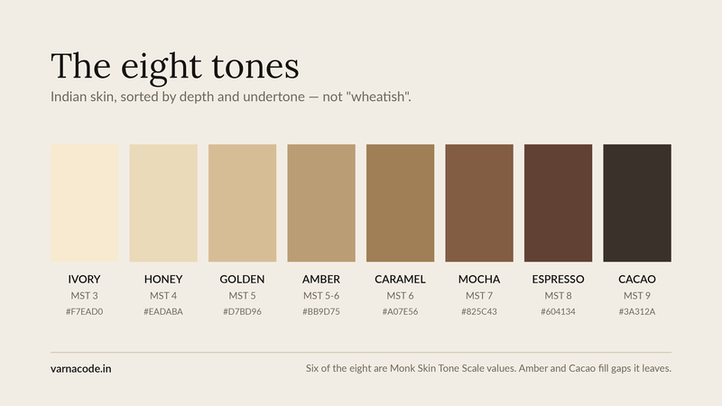

# Colour palettes for medium and deep skin tones

**Eight tones spanning Monk 3–9. Twenty-four palettes. 192 colours with hex values. CC BY 4.0.**

Most colour analysis descends from one of two systems: the Western "seasonal" method, developed around fair Caucasian skin, or the Korean personal-colour system, calibrated for East Asian skin. Both are good. **Neither was built around melanin-rich skin, and the tools reflect it** — the Fitzpatrick scale gives four categories to light skin and two to every shade of brown and black.

This dataset is one attempt at the missing piece: **a machine-readable colour system anchored to the Monk Skin Tone Scale, with undertone treated as an axis separate from depth.**

**Depth and undertone are physical properties, not ethnic ones.** The range covered — Monk 3 through 9 — takes in most South Asian skin, and a great deal of Middle Eastern, North African, Latin American, Southeast Asian and Black skin with it. It was built in India because that is where the gap was most obvious to the person building it. **It is not limited to Indian skin, and nothing in the data is.**

⚠️ **It does not cover Monk 1–2 or Monk 10.** If your skin is very fair or deeper than the deepest swatch here, this dataset does not describe you, and it says so rather than pretending.

Use it, fork it, build on it. Just say where it came from.

---

## What's in it

| File | Contents |
|---|---|
| `tones.json` | The 8 tones, with Monk and Fitzpatrick mappings |
| `palettes.json` | **All 24 palettes** — 8 tones × 3 undertones — 8 colours each, plus colours to avoid |
| `palettes.csv` | The same 192 colours, flat, for spreadsheets and pandas |
| `season-neutrals.json` | Neutrals by seasonal family — **the part most datasets omit** |
| `pairings.json` | A four-term taxonomy for classifying any two-colour combination |
| `make-chart.py` | Regenerates `tone-chart.png` from `tones.json` |

```
tone      undertone  season        colours
────────────────────────────────────────────────────────────
ivory     cool       Cool Summer   Navy #1B2A4A, Slate Blue #6A7FA8, …
golden    warm       Warm Autumn   Mossy Green #6B7C4A, Mustard #C8921A, …
cacao     neutral    Deep Winter   Emerald #1B6B45, Sapphire #1F3C88, …
```

---

## Why depth and undertone have to be separate

Almost every "colours for your skin tone" chart sorts people by **depth alone** — light, medium, dark. Usually five columns.

**Two people at the same depth with opposite undertones need different colours.** Depth tells you how much intensity a colour needs to hold its own. Undertone tells you which colours. Collapse them into one axis and you get five columns that all say roughly the same thing.

So this dataset is a grid, not a list: **8 depths × 3 undertones = 24 palettes.**

## Why eight tones

Six of the eight map directly to the **Monk Skin Tone Scale**, released by Ellis Monk with Google in 2023 specifically because earlier scales under-represented deeper skin.

Two are additions:

- **Amber** fills the Intermediate band, which sits empty on most charts and is where a great deal of medium skin falls
- **Cacao** exists because the deepest swatch on most charts is not the deepest skin

⚠️ **Amber's palette currently overlaps Golden's by 7 of 8 colours.** They share a season, so they also share neutrals. **This is a known weakness, not a hidden one** — see `METHODOLOGY.md`.

---

## Using it

```python
import json
palettes = json.load(open('palettes.json'))

golden_warm = next(p for p in palettes
                   if p['tone'] == 'golden' and p['undertone'] == 'warm')

for c in golden_warm['colours']:
    print(c['name'], c['hex'])
```

```js
const palettes = require('./palettes.json');
const deep = palettes.filter(p => p.season.startsWith('Deep'));
```

Or straight from the raw URL, no download:

```python
import json, urllib.request
URL = 'https://raw.githubusercontent.com/thevarnacode/skin-tone-colour-palettes/main/palettes.json'
palettes = json.load(urllib.request.urlopen(URL))
```

---

## Attribution

CC BY 4.0 asks for credit. Something like:

> Colour palettes from the Varna Code skin tone dataset, CC BY 4.0 — https://varnacode.in

For academic use see `CITATION.cff`.

---

## What this is not

**It is not a medical or dermatological resource.** The Fitzpatrick mappings are included for orientation only; that scale was built in 1975 to predict UV response, not to describe appearance, and it does deeper skin no favours.

**It is not measured from garments.** These are specified colour values, not spectrophotometer readings from fabric. Dye lots, weave and finish will all shift what you actually see.

**It is a system with opinions**, and the opinions are documented rather than hidden. Read `METHODOLOGY.md` before building anything important on it.

---

## Contributing

Corrections welcome, particularly:

- **Measured values** from real garments to check the specified ones against
- **Under-represented tones** — if you sit at a depth or undertone this handles badly, that is the most useful issue you can open
- **The Amber overlap**, which needs solving properly

---

Built by [Varna Code](https://varnacode.in) — a free colour tool for medium and deep skin tones. No selfie, no sign-up.

---


